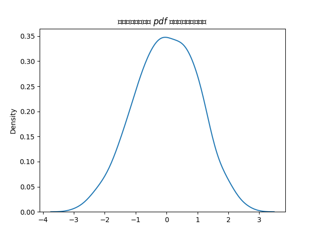

# 自分用 matplotlib alias

<table>
  <tr>
    <th>これが</th>
    <th>こうなる</th>
  </tr>
  <tr>
    <td width="50%"></td>
    <td width="50%"></td>
  </tr>
</table>

pdf の出力例は [`img/sample.pdf`](https://github.com/yuji96/plt/blob/main/img/sample.pdf)

## 機能

- `import plt` でインポートできる。
  - `import matplotlib.pyplot as plt` と書かなくていい。
- グラフを pdf 出力したときにフォントが埋め込まれる。
  - 日本語も対応してる。
- 日本語を入力しても文字化けしない。
- グラフの背景を透過しないようにした。
  - ダークモードでもラベルが消えない。
- 数式が TeX っぽい字体になる。
- なんとなく `plt.kdeplot` で [`sns.kdeplot`](https://seaborn.pydata.org/generated/seaborn.kdeplot.html) を使えるようにした。
- なんとなくグリッドをデフォルトで有効化した。

## インストール

### 最新バージョン

```
pip install git+https://github.com/yuji96/plt.git
```

### 設定を自己流にしたい場合

```
git clone https://github.com/yuji96/plt.git
pip install -e plt
```
`plt/plt.py` をいじると PC 内のどこでもその設定で使用できる。
